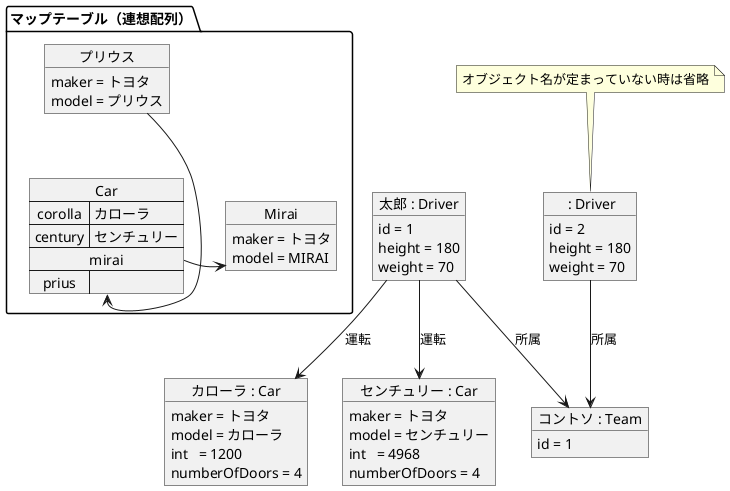

# オブジェクト図

```plantuml

@startuml

object "カローラ : Car" as corolla {
    maker = トヨタ
    model = カローラ
    int   = 1200
    numberOfDoors = 4
}

object "センチュリー : Car" as century {
    maker = トヨタ
    model = センチュリー
    int   = 4968
    numberOfDoors = 4
}

object "太郎 : Driver" as taro {
    id = 1
    height = 180
    weight = 70
}

object " : Driver" as driver {
    id = 2
    height = 180
    weight = 70
}
note top : オブジェクト名が定まっていない時は省略

object "コントソ : Team" as contoso {
    id = 1
}


taro --> corolla : 運転
taro --> century : 運転

driver --> contoso : 所属
taro   --> contoso : 所属


package マップテーブル（連想配列） {
    object Mirai {
        maker = トヨタ
        model = MIRAI
    }
    object プリウス {
        maker = トヨタ
        model = プリウス
    }

    map Car {
        corolla => カローラ
        century => センチュリー
        mirai *-> Mirai
        prius =>
    }
    プリウス --> Car::prius
}

@enduml

```
