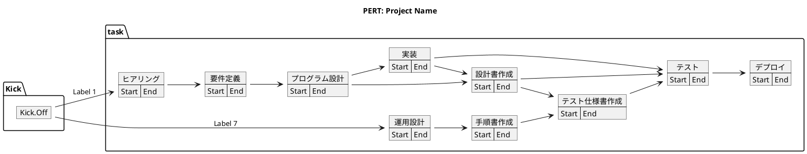

## PERT図

Program Evaluation and Review Technique

```plantuml

@startuml PERT

left to right direction
' Horizontal lines: -->, <--, <-->
' Vertical lines: ->, <-, <->
title PERT: Project Name

map Kick.Off {
}

map "ヒアリング" as task.1 {
    Start => End
}

map "要件定義" as task.2 {
    Start => End
}

map "プログラム設計" as task.3 {
    Start => End
}

map "実装" as task.4 {
    Start => End
}

map "テスト" as task.5 {
    Start => End
}

map "設計書作成" as task.6 {
    Start => End
}

map "運用設計" as task.7 {
    Start => End
}

map "手順書作成" as task.8 {
    Start => End
}

map "テスト仕様書作成" as task.9 {
    Start => End
}

map "デプロイ" as task.10 {
    Start => End
}


Kick.Off --> task.1 : Label 1
Kick.Off --> task.7 : Label 7
task.1 --> task.2
task.2 --> task.3
task.3 --> task.4
task.3 --> task.6
task.4 --> task.5
task.4 --> task.6
task.6 --> task.5
task.6 --> task.9
task.7 --> task.8
task.8 --> task.9
task.9 --> task.5
task.5 --> task.10

@enduml

```
