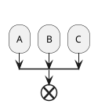
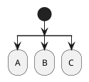
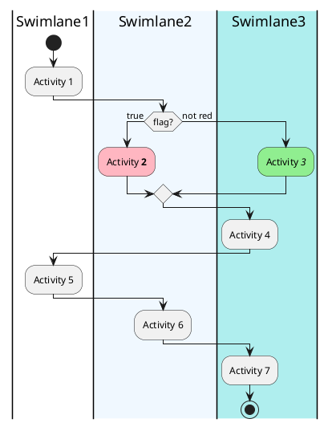

# アクティビティ図

```plantuml

@startuml

start

repeat
    -[#0099FF]->
    #CCFFFF:Sign in;
    -[#blue,dashed]->
    #aqua/CCFFFF:Check credential;
    -[#darkblue,dotted]->

    backward :Wrong password;
    note right : username and / or password is incorrect
repeat while (Valid?) is (no) not (yes)
-[#orange,bold]->
(A)
note right : Connector
-[hidden]->
#paleturquoise:(A)


group 条件文
    partition #aliceblue "**partition** if (...) then (...)" {
        note
            //パーティションのノート//
        end note

        if (User is enabled?) then (yes)
        else (no)
            :Please sign up;
            stop
        endif
    }

    package #aliceblue "**package** if (...) is (...) then" {
        if (Is admin?) is (<color:red>yes) then
            :Show admin menu;
        else
        endif
    }

    rectangle #aliceblue "**rectangle** if (...) equals (...) then" {
        if (Demo flag?) equals (true) then
            :Show live demo;
        else
        endif
    }

    card #aliceblue "**card** else if" {
        ' !pragma useVerticalIf on /' 垂直モード '/
        if (condition A) then (yes)
            :process A;
        elseif (condition B) then (yes)
            :process B;
        (no) elseif (condition C) then (yes)
            :process C;
        else (nothing)
            :process D;
        endif
    }

    group switch
        switch (test?)
            case ( condition A )
                :process A;
            case ( condition B )
                :process B;
            case ( condition C )
                :process C;
        endswitch
    end group
end group


group ラベル
    if (condition A) then (yes)
        '位置合わせのための空白ラベル
        label sp_a
        label sp_b
        'ラベル
        label process_a
        :process A;
    else (no)
        if (condition B) then (yes)
            label process_b
            goto process_a
        else
            :process C;
        endif
    endif
end group


group 繰り返し
    while (not empty)
        note left : 繰り返し（前判定）
        :read data;
    endwhile

    while (buffer?) is (not empty)
        :read file;
    endwhile (empty)
    :close file;

    if (condition A) then
        while (infinite loop)
            :Infinite loop;
        endwhile
        -[hidden]->
        detach
    else
    :pass;
    endif
end group


group 並列処理
    fork
        :Search product;
        :Add to cart;
        split
            :Order;
            :Payment;
            if (Paid?) then (yes)
                :Notify;
            else
                :Payment failure;
                stop
            endif
        split again
            :Cancel order;
        end split
    fork again
        :View profile;
        split
            :Change profile;
        split again
            :Change password;
        end split
    fork again
        :View histories;
    fork again
        :View account data;
        fork
            :Export account data;
        fork again
            :Import account data;
        end merge
    end fork
end group

group SDLプロセス図
:定義済み処理|
:イベント受信<
:イベント送信>
:データ/
:\\
:処理]
:条件分岐}
end group

#CCFFFF:Sign out;

end


floating note left
    = 装飾
    ~**escape**
    **bold** <b>b</b>
    //italics// <i>i</i>
    ""monospaced""
    --stricken-out-- <s:green>s:green</s>
    __underlined__ <u>u</u> <u:red>u:red</u>
    ~~wave-underlined~~ <w:#0000FF>w:#0000FF</w>
    x<sub>2</sub><sup>3</sup>
    <color:red>color:red</color>
    <back:blue>back:blue</back>
    <size:18>size:18</size>
    <img:https://avatars.githubusercontent.com/u/9039417?v=4>

    = コード
    <code>
    def main():
        pass
    </code>

    = リスト
    * 1
    * 2
        ** 2-1
    == 番号リスト
    # a
    # b
    ## b-1

    = 水平線
    ----
    ====
    ....

    = リンク
    [[https://github.com/]]
    [[https://github.com/ya-androidapp ya-androidapp]]
    [[https://github.com/ya-androidapp?tab=repositories{tooltip} repositories]]

    = テーブル
    |= |= A |= B |= C |
    | 1 | <#aqua> A1 | B1 | C1 |
    <#palegreen>| 2 | A2 | B2 | C2 |

end note

@enduml

```

## 複数開始／複数終了

```plantuml

@startuml

split
   -[hidden]->
   :A;
split again
   -[hidden]->
   :B;
split again
   -[hidden]->
   :C;
end split

end

@enduml

```

```plantuml

@startuml

start

split
   :A;
   kill
split again
   :B;
   detach
split again
   :C;
   kill
end split

@enduml

```

## スイムレーン

```plantuml

@startuml

|Swimlane1|
start
:Activity 1;

|#AliceBlue|Swimlane2|
if (flag?) is (true) then
#LightPink:Activity **2**;
else (not red)

|#PaleTurquoise|S3| Swimlane3 /' エイリアス（別名） '/
#LightGreen:Activity //3//;
endif

|S3|
:Activity 4;

|Swimlane1|
:Activity 5;

|Swimlane2|
:Activity 6;

|S3|
:Activity 7;
stop

@enduml

```
