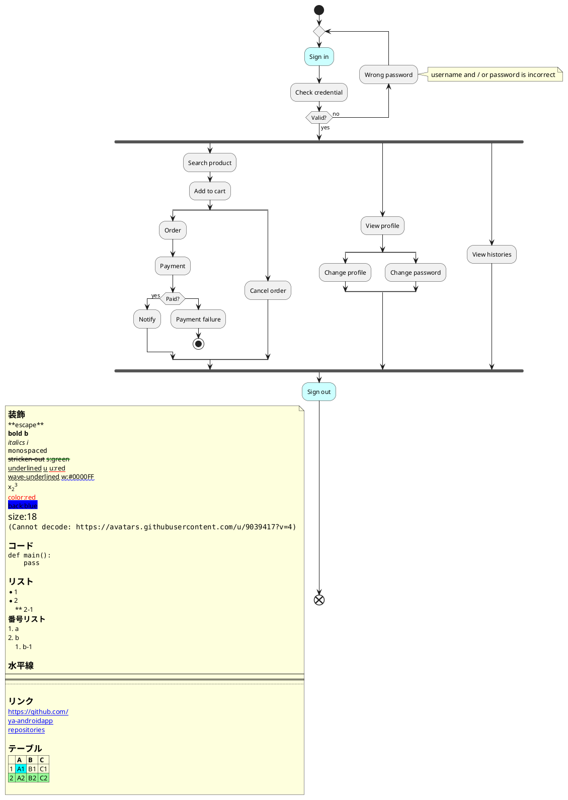

# アクティビティ図

```plantuml

@startuml

start

repeat
    #CCFFFF:Sign in;
    :Check credential;

    backward :Wrong password;
    note right : username and / or password is incorrect
repeat while (Valid?) is (no) not (yes)

fork
    :Search product;
    :Add to cart;
    split
        :Order;
        :Payment;

        if (Paid?) then (yes)
            :Notify;
        else
            :Payment failure;
            stop
        endif

    split again
        :Cancel order;
    end split
fork again
    :View profile;
    split
        :Change profile;
    split again
        :Change password;
    end split
fork again
    :View histories;
end fork

#CCFFFF:Sign out;

end


floating note left
    = 装飾
    ~**escape**
    **bold** <b>b</b>
    //italics// <i>i</i>
    ""monospaced""
    --stricken-out-- <s:green>s:green</s>
    __underlined__ <u>u</u> <u:red>u:red</u>
    ~~wave-underlined~~ <w:#0000FF>w:#0000FF</w>
    x<sub>2</sub><sup>3</sup>
    <color:red>color:red</color>
    <back:blue>back:blue</back>
    <size:18>size:18</size>
    <img:https://avatars.githubusercontent.com/u/9039417?v=4>

    = コード
    <code>
    def main():
        pass
    </code>

    = リスト
    * 1
    * 2
        ** 2-1
    == 番号リスト
    # a
    # b
    ## b-1

    = 水平線
    ----
    ====
    ....

    = リンク
    [[https://github.com/]]
    [[https://github.com/ya-androidapp ya-androidapp]]
    [[https://github.com/ya-androidapp?tab=repositories{tooltip} repositories]]

    = テーブル
    |= |= A |= B |= C |
    | 1 | <#aqua> A1 | B1 | C1 |
    <#palegreen>| 2 | A2 | B2 | C2 |

end note

@enduml


```
