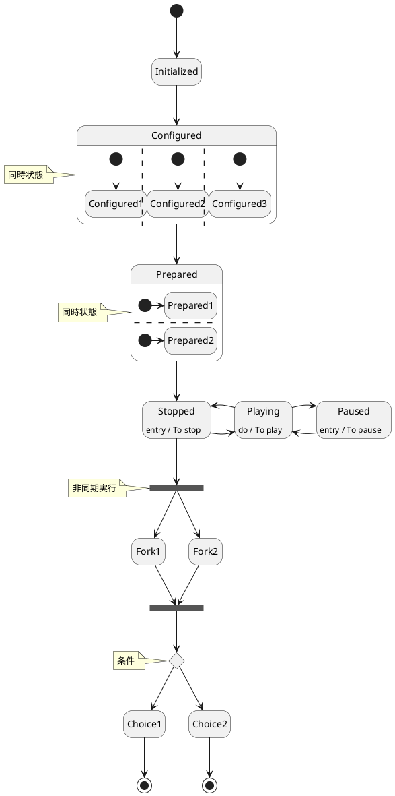

# 状態図

```plantuml

@startuml

hide empty description


state c <<choice>>
state end_state <<end>>
state fork_state <<fork>>
state join_state <<join>>
state Playing : do / To play
state Paused : entry / To pause
state Stopped : entry / To stop

state Configured {
    [*] -down-> Configured1
    ||
    [*] -down-> Configured2
    ||
    [*] -down-> Configured3
}

state Prepared {
    [*] -right-> Prepared1
    --
    [*] -right-> Prepared2
}


' 条件
join_state --> c
c --> Choice1
c --> Choice2
Choice1 --> [*]
Choice2 --> end_state


' 非同期実行
Stopped --> fork_state
fork_state --> Fork1
fork_state --> Fork2
Fork1 --> join_state
Fork2 --> join_state


' Note
note left of Configured : 同時状態
note left of Prepared : 同時状態
note left of fork_state : 非同期実行
note left of c : 条件


' 遷移
[*] --> Initialized
Initialized --> Configured
Configured --> Prepared
Prepared --> Stopped

Stopped -right-> Playing
Playing -left-> Stopped
Paused -left-> Playing
Playing -right-> Paused

@enduml

```
